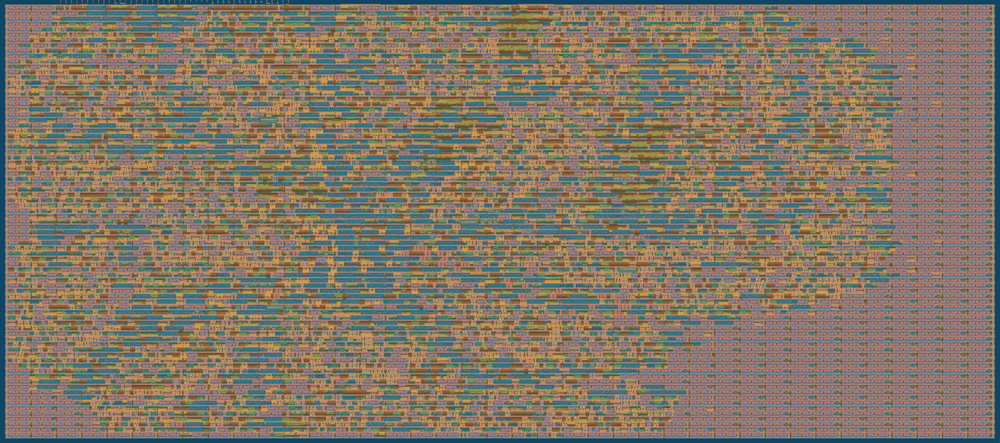

<!---

This file is used to generate your project datasheet. Please fill in the information below and delete any unused
sections.

You can also include images in this folder and reference them in the markdown. Each image must be less than
512 kb in size, and the combined size of all images must be less than 1 MB.
-->

## How it works

TinyTPU multiplies a signed-INT6 4x8 matrix by an 8x4 matrix. It retains the
original 4x4 systolic array and its 16 multiply-accumulate processing elements.
The shared K dimension arrives as two consecutive K=4 tiles; each PE keeps its
15-bit partial sum across both tiles and is only flushed and cleared after all
eight products for that output have accumulated.

Completed signed sums pass through ReLU and saturate to the unsigned 12-bit
output range (0 to 4095). Results are serialized over the existing Tiny Tapeout
GPIO interface, one 12-bit value per clock once output streaming begins.
Each completed anti-diagonal occupies a four-value output group; unused lanes
in that group are zero, never an intermediate partial sum.

### Layout preview

[View the full-resolution version 2 layout](https://riverawijaya.github.io/TinyTPU/version2/gds_render.png).

## How to test

Each A or B element is a signed 6-bit two's-complement value (-32 to 31). The
result is a 4x4 matrix of unsigned 12-bit ReLU/saturated values.

### Input Load
Notation: A_ij refers to the element in the ith row and jth column of matrix A.

Matrix A elements are loaded into GPIO input pins uin[5:0]. Matrix B elements are loaded into both the input and bidirectional pins such that the top 2 bits (bits 4 and 5) are loaded through uin[7:6] and the bottom 4 bits (bits 0 to 3) are loaded through the bidirectional uio_in[3:0].

Inputs use the usual systolic wavefront. For update step `t`, serialized clock
`i` (0 through 3) carries `A[i][t-i]` and `B[t-i][i]`; out-of-range K indices
are zero. Each update therefore takes four physical clock cycles. K=8 needs
eight accumulation updates, followed by six wavefront-drain updates.

## External hardware

The project requires an external microcontroller that can send inputs and read outputs from the chip's GPIO pins.
